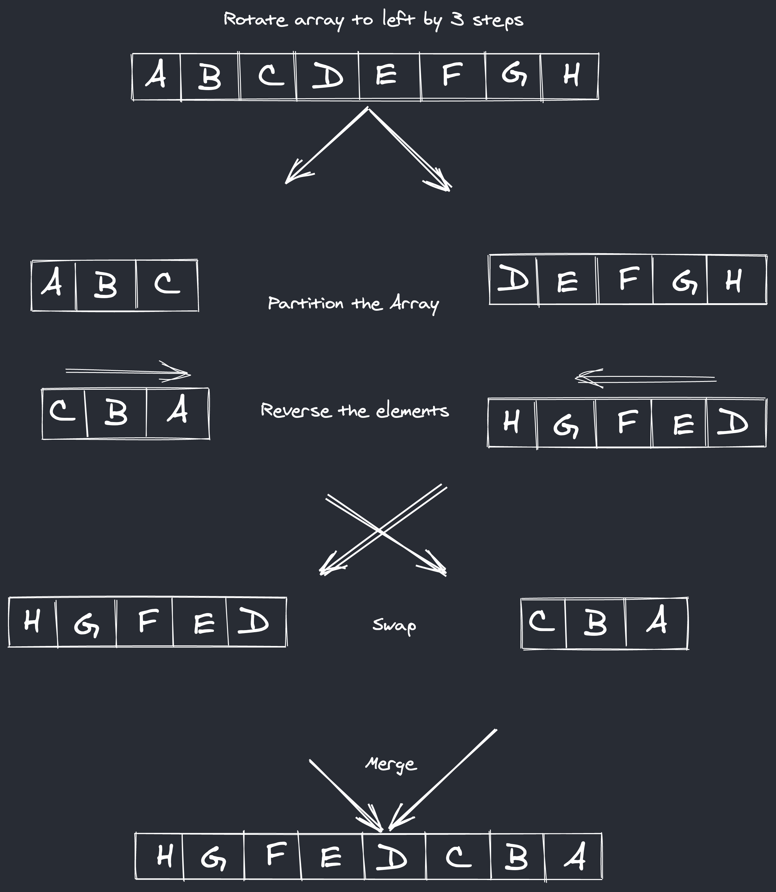

+++
title = "Programming Pearls - Array Rotation"
date = "2019-11-07"
summary = "Programming, Pearls and a couple of interesting solutions for rotating elements within an array"
tags = ["Misc"]
type = "note"
toc = false
readTime = true
autonumber = false
showTags = false
slug = "array-rotation"
+++

Just began working through
[_Programming Pearls_](https://www.oreilly.com/library/view/programming-pearls-second/9780134498058/)
by Jon Bentley. So far, it's fun with really engaging problems and solutions.
Like this one:

> Rotate a one-dimensional array of N elements left by l positions. For
> instance, with N=8 and l=3, the vector ABCDEFGH is rotated to DEFGHABC. Simple
> code uses an N-element intermediate vector to do the job in N steps. Can you
> rotate the vector in time proportional; to N using only a few extra words of
> storage?

The 'naive' solution provided is well, naive. And as the problem prompts, we can
do better.

The first solution that popped up in my mind was linked-lists - linked-lists
just seemed like the kind of data-structure meant for rotations: if the array
could somehow be converted into a linked-list, followed up by traversing the
first **l** elements and juggling a couple of pointers, the problem could be
solved. But this seemed to have more overhead and would have ended up taking
more space than simply allocating an intermediate n-element array and using it
for the rotation. Besides, as Bentley pointed out later on from Kernighan's
report, folks who based their solution on linked-lists concluded that such an
approach tends to be bug-ridden.

While trying to work something else out, it hit me that all array rotations are
merely a subset of permutations. Formally, from Artin's
[Algebra](https://www.pearson.com/us/higher-education/product/Artin-Algebra-2nd-Edition/9780132413770.html)
book, a _permutation_ of a set S is a bijective map p from the set S to itself.
That's quite a mouthful. Think of permutations as just a different orderings or
arrangements of the same elements. Again, formally, the **cycle notation** is
used to represent permutations. To illustrate how this notation is derived,
consider the diagram below:


**a**'s index moves from 1 to 4. The element that was in the 4th index, **d**,
has its index move from 4 to 5. As for **e**, 5 to 2 and **b**, 2 back to 1,
**a**'s index. A cycle! This can be represented as (**1452**). **c** and **f**
remain in the same position. **g** and **h** are swapped, forming another
2-cycle (**78**). The whole permutation can be represented as
(**1452**)(**78**). The 1-cycles for **c** and **f** are usually omitted from
the representation. Do note that the cycle notation representation of a
permutation is not unique, for example, (**341**), (**134**) and (**413**) both
represent the same permutation.

Now back to array rotation, if you work it out, the rotation **ABCDEFGH &rarr;
DEFGHABC** in cycle notation form is (**16385274**). With this, it becomes
trivial to rotate an array: just allocate extra space for a single element and
use it to swap around the elements till the end of the cycle. Now, all that
remained was to find a way to generate the cycle representation of a given a
rotation efficiently.

Pencil to paper and a couple of minutes later on, this is what I had: if moving
an index to the left by 3 is like substracting but I still want the index to be
within the range [1,8] then I have to use modulo somehow. This totals up as: to
get the ith element's next position, calculate **(i - 3) mod 8**. For example
**(1 - 3) mod 8 = 6** and **(6 - 3) mod 8 = 3** and so on and so forth.

Bringing in everything together in Python, we have:

```python
def rotate(arr, steps):
    temp, i, N = arr[0], 0, len(arr)
    for _ in range(N):
        i = (i - steps) % N
        arr[i], temp = temp, arr[i]

arr = list("ABCDEFGH")
rotate(arr, 3)  # DEFGHABC
```

Satisfied with my solution, I decided to compare it with Bentley's, hoping that
we both arrived at the same solution.

Aaand... what can I say, his was more _profound_ - and true to the chapter's
title, a definite Aha! algorithm.

The first insight that Bentley provides is that if we partition the array into
**AB** where **A** has first **l** elements and **B** has the rest, then
rotation boils down to transforming **AB** to **BA**.

From there, let the superscript **r** denote either the operation of reversing
elements within an array or reversing the order of partitions.

As the image below shows, to rotate the array, we first reverse the elements
within the first partition and the second partition: **A&rarr;A<sup>r</sup>**,
**B&rarr;B<sup>r</sup>**.



From there, we swap both partitions, resulting in **(A^rB^r)^r**, which ends up
as... **BA**, exactly what we wanted.

Problem solved!