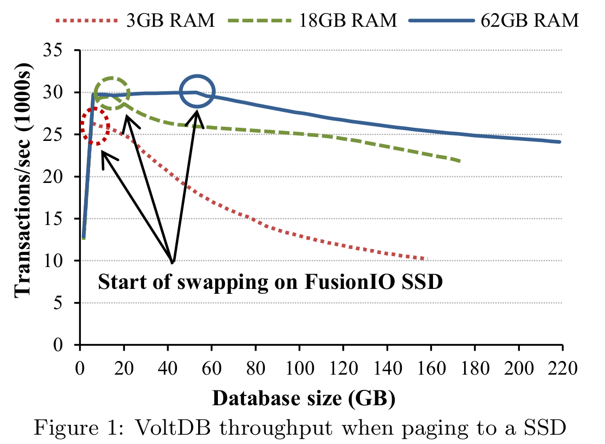
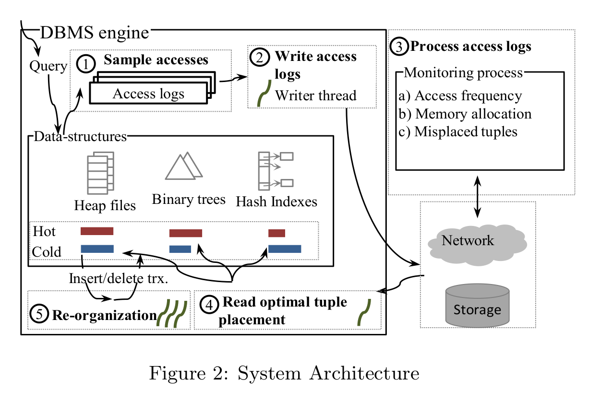
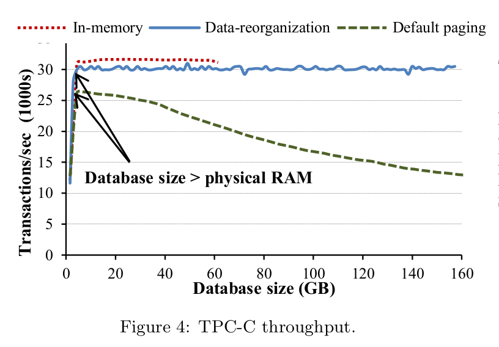

+++
title = "Virtual Memory Hot/Cold Data Re-organization for OLTP"
date = "2024-06-07"
summary = "Hot/Cold aware memory allocation with locking of the hot region to physical memory and letting the OS swap out cold LRU pages as needed."
tags = ["Database Internals"]
type = "note"
toc = false
readTime = true
autonumber = false
showTags = false
slug = "efficient-os-paging-hot-cold-db"
+++

The problem: In OLTP databases designed for main-memory, the datasets might
exceed the main memory capacity. Bringing back a disk-oriented architecture
fixes this problem, though at the cost of increased complexity and reduced
performance: "DBMS engines optimized for in-memory processing have no knowledge
of secondary storage. Traditional storage optimizations, such as the buffer pool
abstraction, the page organization, certain data structures (e.g. B-Trees), and
ARIES-style logging are explicitly discarded in order to reduce overhead" [1].

A simpler solution which involves doing nothing is to rely on the OS's default
paging. However it is sub-optimal since the OS can only use coarse-grained
metrics to determine what to keep in-memory and what to page out.

To demonstrate the performance impact on relying on the default OS paging
approach, the authors carry out an experiment whereby the working set's size is
fixed and can fit in memory. Once the dataset exceeds main-memory, query
processing throughput decreases as OS paging kicks in. The throughput decrease
is more severe in instances where the RAM size is smaller.

Figure from [1]:

The authors instead propose a smarter way to rely on OS paging: given that most
if not all OLTP workloads tend to exhibit skew whereby some records are hot and
most records are cold, the database should partition virtual memory into a hot
region and a cold region. The hot region remains/is locked to in-memory (the OS
is not allowed to page it out) and as for the cold region, the OS is free to
swap out LRU resident regions whenever a query accesses a cold paged out tuple.

## Data-Reorganization

Step-by-step, the authors' solution is as follows:

Figure from [1]:

1. **Sample accesses**: log every tuple access into a circular buffer per a
   given sampling frequency. A log entry should include the tuple ID and its
   current classification (hot or cold).
2. **Write access logs**: the logs are written either to a file or to a network.
   For performance reasons, the writer is decoupled from the critical path of
   query execution. If the writer is slow, the sampling frequency decreases
   (more log entries are dropped).
3. **Process access logs**: Ideally in a different server, compute the access
   frequencies from the access trace: hot tuples that aren't getting accessed as
   often are re-categorized as cold and cold tuples that are now getting
   accessed a lot more are re-categorized as hot [2]. Furthermore, each table is
   assigned a computed _memory budget_ i.e. the size for its hot region. For the
   sake of comparison, if you recall in the
   [anticaching approach](/blog/anti-caching), the memory budget for a table is
   determined dynamically by how much it's been accessed since the last round of
   evictions: the more a table is accessed, the less the data that's evicted
   from it and vice versa.
4. **Read optimal tuple placement**: via a dedicated thread once step 3 is
   complete.
5. **Re-organization**: Using a hot-cold aware malloc, delete and re-insert
   tuples whose status has changed. By hot-cold aware, this means that if the
   tuple is hot, malloc will allocate memory for it in the hot region, same as
   with cold tuples. The high-level delete/re-insert is necessary to keep all
   indices consistent, plus we get to reuse code. It's worth noting that the hot
   region is 'locked' to memory to prevent the OS from swapping it out [3].

To evaluate this approach, the authors carry out a couple of experiments. I'll
highlight the first one which involves a modified TPC-C benchmark. There are
three cases:

- entire database is in memory (allocated 64 GB)
- default OS paging: database restricted to 5GB of main memory
- data-reorganization: database restricted to 5GB of main memory

Figure from [1]:

From the paper: "the hot/cold data separation stabilizes throughput within 7% of
the in-memory performance, although the actual data stored grows 50x larger than
the amount of RAM available. On the other hand, the throughput of the unmodified
engine drops by 66% when swapping to the SSD".

Overall, this approach seems relatively simple since much of the heavy-lifting
is left to the OS. One aspect I'd have wished for the authors to dig deeper into
is when data-reorganization should be triggered - which exact metrics are
measured and what thresholds are used. Also, does data-reorganization handle
only the case where all tuples in a relation have the same size - if otherwise,
I suppose it'll be much closer to a full-on seperate malloc implementation.
There's also
[vmcache](https://www.cs.cit.tum.de/fileadmin/w00cfj/dis/_my_direct_uploads/vmcache.pdf)
which can be used to let the system have greater control over page faulting and
eviction which then provides the option for abort-and-restart if a transaction
accesses an evicted page.

## References

1. [Enabling Efficient OS Paging for Main-Memory OLTP Databases - Radu Stoica,
   Anastasia Ailamaki](https://dl.acm.org/doi/10.1145/2485278.2485285)
2. [Efficient hot/cold categorizing Identifying Hot and Cold data in Main-Memory
   Databases - Justin J. Levandoski, Per-Ake Larson, Radu Stoica](https://www.microsoft.com/en-us/research/wp-content/uploads/2013/04/ColdDataClassification-icde2013-cr.pdf)
3. [Using mlock to Avoid Page I/O - Redhat Reference Guide](https://access.redhat.com/documentation/en-us/red_hat_enterprise_linux_for_real_time/7/html/reference_guide/using_mlock_to_avoid_page_io)
