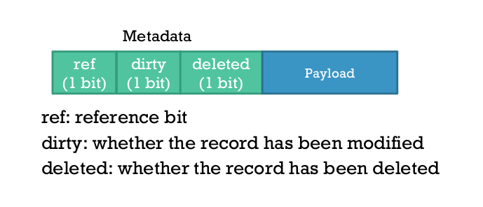

+++
title = "Tiered Storage via 2-Tree"
date = "2024-06-10"
summary = "Split a data-structure into two: a memory-optimized 'top'-tree and a disk optimized 'bottom'-tree. Implement a lightweight migration protocol for hot records to move up and cold records down."
tags = ["Database Internals", "Paper Review"]
type = "note"
toc = false
readTime = true
autonumber = false
showTags = false
slug = "two-tree"
+++

Paper:
[Two is Better Than One: The Case for 2-Tree for Skewed Data Sets -
Xinjing Zhou, Xiangyao Yu, Goetz Graefe, Michael Stonebraker](https://www.cidrdb.org/cidr2023/papers/p57-zhou.pdf)

Here's a high-level overview of the 2-Tree approach:

- Take a logical data structure such as a tree (ordered map)
- Implement it as two separate physical data structures, a _top tree_ that is
  memory optimized and a _bottom tree_ that is optimized for disk access
- Put in place a lightweight migration protocol such that hot records move to
  the top tree (up-migration) while cold records move to the bottom tree
  (down-migration)
- For up-migration, probabilstically determine whether to move a record to the
  top tree whenever it's fetched from the bottom tree. If a record is indeed
  hot, then it will have a higher chance of getting sampled
- For down-migration, use a lightweight cache eviction algorithm
  (clock/second-chance replacement in the paper) to evict LRU records to the
  bottom tree.

2-Tree contrasts with the
[R Stoica & Ailamaki approach](/notes/2024/efficient-os-paging-hot-cold-db) in
that with the latter, you've got a single physical (in-memory) data-structure
with hot records being placed in an `mlock`-ed region of virtual memory while
the cold records are placed in regions that can be paged in and out by the OS as
needed. The R. Stoica & Ailamaki also uses a more accurate though offline method
to categorize hot vs cold records.

For **downward migration**: "A clock handle, i.e., a key value indicating the
current progress of the eviction scan, is maintained in memory. When eviction is
needed, the system cycles through every record starting after the clock handle.
It collects records with the reference bit off for eviction. It also clears the
reference bit of records examined. The scan stops when the desired number of
records has been collected".

For **Upward Migration**, the authors describe it as follows: "we adopt a
sampling-based approach where we move only a sample of accessed records upwards.
We define a sampling rate as D (0 < D ≤ 1). For data that is becoming hot, its
frequency of access increases, and therefore it will be more likely to end up in
the sample set".

If upward migration is performed eagerly rather than probablistically, then
during scans, hot records in the top tree might be evicted by cold entries that
are only accessed once, thus reducing memory utilization. Therefore, the `D`
parameter should be thought of as a lightweight means (in terms of CPU and
memory) for preventing thrashing: "A large sampling rate warms up the cache
quickly while providing little thrash resistance. In contrast, a small sampling
rate delivers thrash resistance by sacrificing the warm-up rate". More
heavy-weight approaches can be considered though as the authors point out:
"These strategies typically employ some form of cache partitioning and/or
frequency tracking that incur non-trivial per-record bookkeeping".

Another aspect worth considering when carrying out migrations is whether a
record can exist in both the top tree and bottom tree. With an **exclusive
policy**: "the system only keeps one copy of the record in either the top or
bottom tree. When migrating data from the bottom tree upwards, the record is
erased from the bottom tree". On the other hand, with an **inclusive policy**,
the bottom tree is not modified during migration - the top tree maintains the
freshest version of the record. Inclusive policy minimizes IO costs though it
uses up more disk space.

Figure from 2-Tree paper:

Additional details to consider:

- If the logical data structure should provide atomicity, consistency and
  durability guarantees (such as in database indexes), then modifications to the
  2-Tree and migrations should be carried out transactionally.
- Range scans need to account for instances where a record is both in the top
  tree and the bottom tree. In such cases, the top tree version is emitted since
  it's fresher.
- Deletes are carried out in a lazy/deferred manner. That is, if a record is in
  the top tree, the delete bit is set and the operation returns immediately. If
  a record is not in the top tree, then a tombstone entry is inserted to the top
  tree. In both cases, the actual delete is carried out later on during
  evictions.
- Updates are also carried out in a lazy/deferred manner in cases where the
  record resides in the bottom tree. A _dirty bit_ is used to indicate that the
  stale record in the bottom tree should be updated during evictions.

Overall, one thing I appreciate with 2-Tree is that like the R. Stoica &
Ailamaki approach, it's quite simple to understand and implement. Also, just as
with Leanstore, the authors favour low-overhead low-complexity approaches.
Future directions might entail extending 2-Tree to other data-structures such as
hash-maps, figuring out a way to dynamically tune the `D` sampling parameter and
incorporating concurrency control such that migrations can even be carried out
in parallel.
