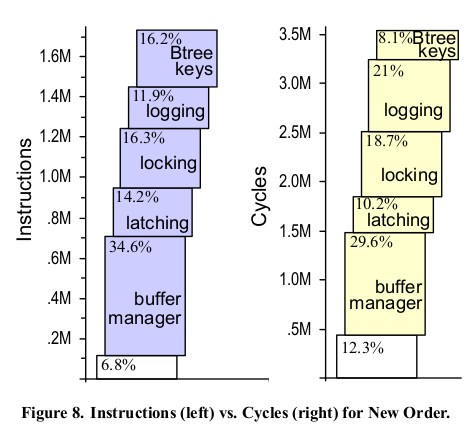

+++
title = "Larger-Than-Memory Data Management"
date = "2024-06-04"
summary = "For when the database exceeds the main memory size"
tags = ["Database Internals"]
type = "post"
toc = false
readTime = true
autonumber = false
showTags = false
featured = true
slug = "larger-than-mem-intro"
+++

According to [1], the ideal DBMS is one that "has high performance,
characteristic of main-memory databases, when the working set fits in RAM" and
"the ability of a traditional disk-based database engine to keep cold data on
the larger and cheaper storage media, while supporting, as efficiently as
possible, the infrequent cases where data needs to be retrieved from secondary
storage".

To realize a system that achieves both requirements, there are two approaches:
(1) take a disk-based databases and optimize it for the former, or (2) take a
main-memory database and optimize it for the latter.

The first approach would require a full architectural rework. This is because
there isn't one single glaring bottleneck - everything from the buffer pool
manager to the recovery component contributes constant significant overhead with
'useful work' comprising a small fraction of instructions processed in a query
(figure from 'OLTP Through the Looking Glass, and What We Found There'):

Hence the current tendency to favour the second approach [8,9]: take highly
optimized main-memory systems and extend them to handle larger-than-memory
workloads. This is key not just for resource flexibility but also for lowering
costs: DRAM is still quite costly while SSDs have gotten drastically cheaper and
offer greater performance (IOPS). There's also data skew - a some parts of data
tends to be hot while most of the data tends to be cold. Therefore, it makes
more economic sense to keep hot data in main-memory and only page in cold data
from secondary storage when needed [6,4,5]. Since most queries will hit the hot
memory-resident data, the overall impact on performance should be minimal.

There are a couple of considerations when it comes to larger-than-memory
approaches: how should the system identify hot data from cold (offline periodic
analysis vs online), what is the granularity of identification (page-level or
record-level), how is metadata maintained, how should queries that touch cold
data be handled (synchronous retrieval or abort-and-restart), and so on [7,8].
This is why I've decided to do an informal survey of all the
'larger-than-memory' techniques out there in the next couple of posts, so that I
can understand the trade-offs and get a glimpse of the cutting edge. Do stay
tuned!.

Update: I'm done!. Here's the list:

1. [Anti-Caching](/notes/2024/anti-caching/)
2. [Offline Classification of Hot and Cold Data](/notes/2024/project-siberia-hot-cold-id/)
3. [Hot/Cold Data-Reorganization in Virtual Memory for efficient OS Paging](/notes/2024/efficient-os-paging-hot-cold-db/)
4. [Compacting Transactional Data in HyPer DB](/notes/2024/hyper-compaction/)
5. [Utilizing Pointer Swizzling in Buffer Pools](/notes/2024/pointer-swizzling/)
6. [Tiered Stroage via 2-Tree](/notes/2024/two-tree/)
7. [Leanstore: High Performance Low-Overhead Buffer Pool](/blog/leanstore/)

## References

1. [Enabling Efficient OS Paging for Main-Memory OLTP Databases - Radu Stoica, Anastasia Ailamaki](https://www.inf.ufpr.br/carmem/oficinaBD/artigos2s2013/a7-stoica.pdf)
2. [OLTP through the looking glass, and what we found there - Stavros Harizopoulos, Daniel Abadi, Samuel Madden, Michael Stonebraker](https://dl.acm.org/doi/10.1145/1376616.1376713)
3. [The End of an Architectural Era (It’s Time for a Complete Rewrite) - Michael Stonebraker et al](http://nms.csail.mit.edu/~stavros/pubs/hstore.pdf)
4. [The 5 Minute Rule for Trading Memory for Disc Accesses and The 10 byte Rule for Trading Memory for CPU Time - Jim Gray](https://dl.acm.org/doi/pdf/10.1145/38714.38755)
5. [The Five Minute Rule 30 Years Later and Its Impact on the Storage Hierarchy - Raja Appuswamy, Goetz Graefe, Renata Borovica-Gajic, Anastasia Ailamaki](https://cs-people.bu.edu/mathan/reading-groups/papers-classics/5minrule2019.pdf)
6. [Data Caching Systems Win the Cost/Performance Game - David Lomet](https://www.semanticscholar.org/paper/Data-Caching-Systems-Win-the-Cost-Performance-Game.-Lomet/c8d099c4d3b441e9c1b83a6af46b484afc4979bc)
7. [Larger-Than-Memory Database Architectures - Andy Pavlo - CMU Advanced Database Systems Spring 2020](https://www.youtube.com/watch?v=oVro2uEzQ9s)
8. [Larger-than-Memory Data Management on Modern Storage Hardware for In-Memory OLTP Database Systems - Lin Ma et al](https://dl.acm.org/doi/pdf/10.1145/2933349.2933358)
9. [Auto Tiering Offers Twice the Throughput at Half the Latency for Large Datasets - Alon Magrafta - Redis](https://redis.io/blog/introducing-auto-tiering/)
10. [In-memory vs. disk-based databases: Why do you need a larger than memory architecture? - Andi Skrgat - Memgraph](https://memgraph.com/blog/in-memory-vs-disk-based-databases-larger-than-memory-architecture)
